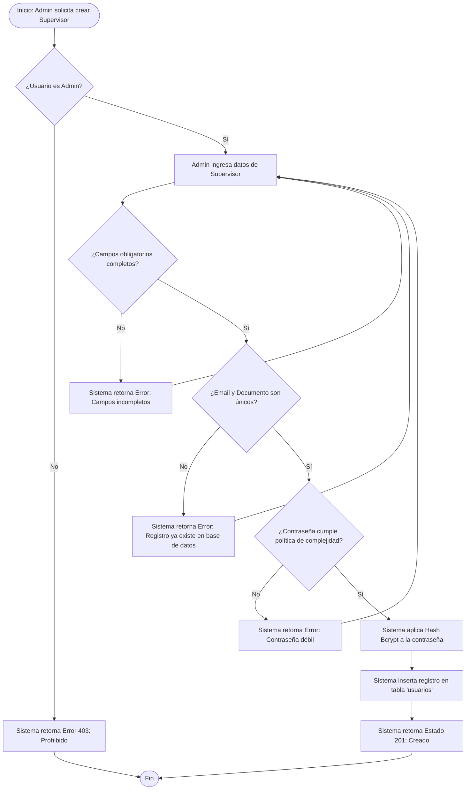
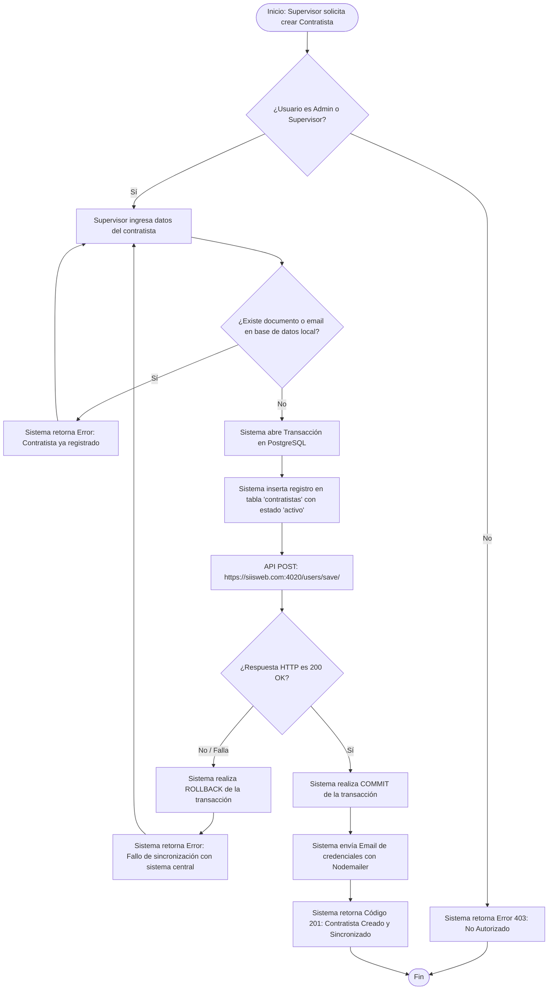
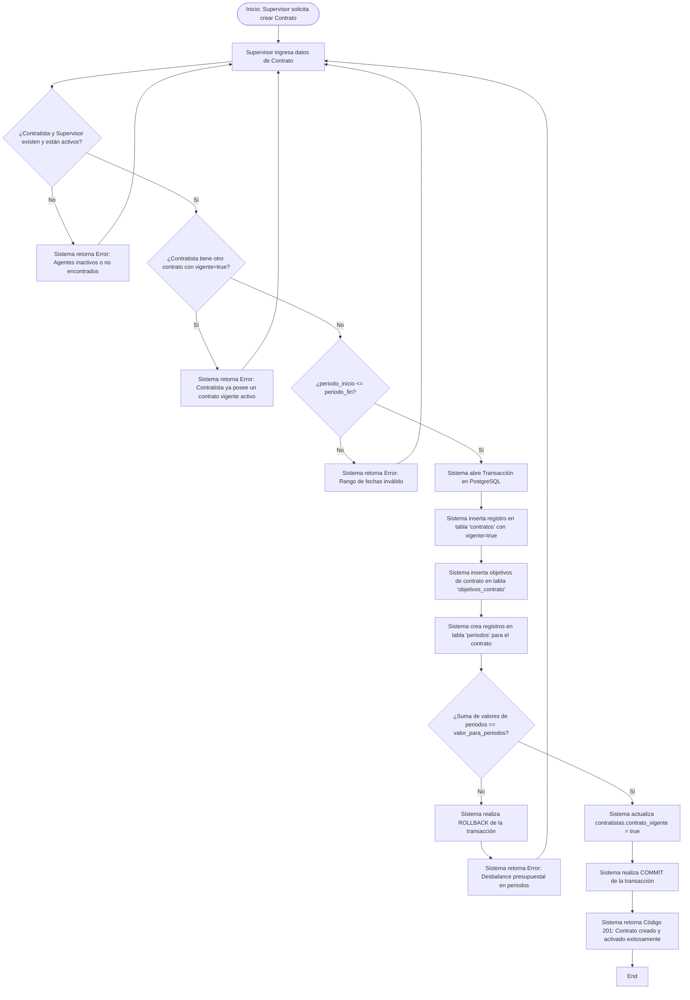
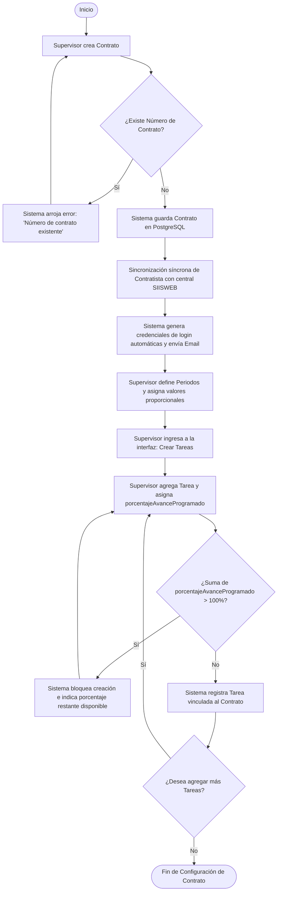
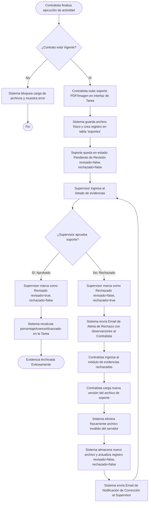
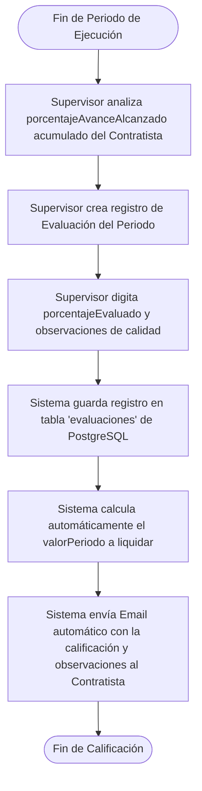

# ESPECIFICACIÓN DE REQUERIMIENTOS Y REGLAS DE NEGOCIO EN DETALLE

## Sistema de Gestión de Contratos, Tareas y Evidencias (SIISWEB Contratos)

---

## 1. INTRODUCCIÓN Y ALCANCE

Este documento define la **Especificación de Requerimientos de Software (SRS)** y las **Reglas de Negocio** detalladas para el sistema de **Gestión de Contratos, Tareas y Evidencias (SIISWEB Contratos)**.

El sistema anterior estaba implementado bajo una arquitectura desacoplada utilizando:

- **Backend**: Node.js, Express, MongoDB (Mongoose) y Nodemailer para notificaciones por correo.
- **Frontend**: Angular 9, PrimeNG y Bootstrap.

El objetivo de esta especificación es servir como plano de construcción absoluto para **rediseñar el sistema completo** utilizando una base de datos relacional robusta en **PostgreSQL**, garantizando la integridad referencial, consistencia de datos y un óptimo desempeño de las consultas mediante un diseño relacional normalizado.

---

## 2. ACTORES Y ROLES DEL SISTEMA (AGENTES CLAVE)

El sistema opera bajo un control de acceso basado en roles (RBAC) estricto. Los tres agentes clave son:

| Actor / Agente    | Descripción y Responsabilidades Operativas                                                                                                                                                                                                                                                                                                                                                                                                         |
| :---------------- | :------------------------------------------------------------------------------------------------------------------------------------------------------------------------------------------------------------------------------------------------------------------------------------------------------------------------------------------------------------------------------------------------------------------------------------------------- |
| **Administrador** | - Posee control total sobre la plataforma.<br/>- Aprovisiona cuentas de **Supervisores**.<br/>- Gestiona configuraciones globales del sistema.<br/>- Monitorea auditorías y logs del sistema.                                                                                                                                                                                                                                                      |
| **Supervisor**    | - Representa al ente contratante o jefe de área.<br/>- Crea **Contratistas** en el sistema local (sincronizándolos externamente).<br/>- Registra y configura **Contratos** y sus periodos de facturación.<br/>- Crea, edita y asigna **Tareas** con metas cuantitativas y acumulados.<br/>- Aprueba o rechaza los soportes físicos de evidencias subidos por los contratistas.<br/>- Evalúa cualitativa y cuantitativamente cada periodo de cobro. |
| **Contratista**   | - Agente ejecutor del contrato.<br/>- Accede al sistema con credenciales asignadas de forma automática.<br/>- Registra el progreso real de las tareas.<br/>- Carga archivos de soporte (evidencias) para justificar el avance por periodo.<br/>- Subsa y vuelve a cargar los soportes rechazados por el supervisor.<br/>- Consulta sus calificaciones periódicas.                                                                                  |

---

## 3. ANÁLISIS DE DETALLES OCULTOS DEL SISTEMA LEGADO

Tras una auditoría minuciosa del código fuente del backend y del frontend, se han extraído varios detalles técnicos, middleware e integraciones críticas que deben ser considerados para el diseño de la nueva aplicación.

### 3.1. Configuración de Seguridad de Red (SSL/TLS Nativos)

- **HTTPS Mandatorio en Producción:** El backend original está configurado para ejecutarse estrictamente bajo el protocolo seguro **HTTPS**. Carga de forma nativa los certificados SSL/TLS emitidos por **Let's Encrypt** para el dominio `siisweb.com` desde rutas del sistema operativo:
  - **Llave Privada:** `../../etc/letsencrypt/live/siisweb.com/privkey.pem`
  - **Certificado de la Entidad:** `../../etc/letsencrypt/live/siisweb.com/fullchain.pem`
  - **Cadena de Confianza:** `../../etc/letsencrypt/live/siisweb.com/chain.pem`
- **Recomendación de Transición:** Para la nueva arquitectura, se aconseja **desacoplar** la gestión de SSL/TLS del backend de la aplicación. En su lugar, se debe utilizar un proxy inverso moderno como **Nginx**, **Caddy** o un **API Gateway** (ej. AWS API Gateway, Kong) que realice la terminación SSL y redirija el tráfico HTTP limpio al backend, simplificando la lógica de código y automatizando la renovación de certificados.

### 3.2. Limitación de Payload (Body Parser a 50MB)

- **Configuración del Middleware:** El backend utiliza `body-parser` configurado con un límite estricto de tamaño de carga de **50 Megabytes** tanto para peticiones JSON como para datos codificados en URL (`urlencoded`):
  ```javascript
  app.use(bodyParser.json({ limit: "50mb" }));
  app.use(bodyParser.urlencoded({ limit: "50mb", extended: true }));
  ```
- **Justificación de Negocio:** Este límite sobredimensionado es indispensable ya que los contratistas cargan archivos adjuntos, PDFs pesados, imágenes y múltiples evidencias de tareas de forma masiva en una sola petición.
- **Recomendación de Transición:** La nueva aplicación debe contemplar este límite de tamaño en el parser de peticiones de su framework (ej. NestJS, Django, FastAPI) y también configurar el tamaño máximo de cuerpo permitido en el proxy inverso (ej. `client_max_body_size 50M;` en Nginx) para evitar bloqueos del servidor.

### 3.3. Compresión de Respuestas en Red (Gzip/Deflate)

- **Middleware de Compresión:** El servidor Express incorpora compresión gzip activa a través del paquete `compression`. Posee un umbral (`threshold`) de **0 bytes**, lo que significa que **todas** las respuestas son comprimidas independientemente de su tamaño.
- **Filtro x-no-compression:** Incorpora una regla especial de bypass: si la cabecera de la petición contiene `'x-no-compression'`, la compresión se desactiva para esa petición:

  ```javascript
  const shouldCompress = (req, res) => {
    if (req.headers["x-no-compression"]) return false;
    return compression.filter(req, res);
  };
  ```

- **Recomendación de Transición:** Mantener esta capacidad en la nueva plataforma, delegando la compresión gzip/brotli directamente al proxy inverso (Nginx/Cloudflare) para descargar de CPU al backend de la aplicación.

### 3.4. Algoritmo de Hashing Criptográfico Legado (HMAC-SHA256)

- **Método de Encriptación Anterior:** Las contraseñas en el backend se cifraban mediante una función utilitaria que implementaba un algoritmo **HMAC con SHA256** utilizando la llave secreta fija `'siellano'`:
  ```javascript
  const hmac = crypto
    .createHmac("sha256", "siellano")
    .update(password)
    .digest("hex");
  ```
- **Recomendación de Transición (Migración de Usuarios):**
  1.  Para mayor seguridad, la nueva aplicación debe adoptar algoritmos de derivación de llaves más robustos como **bcrypt** o **Argon2id**.
  2.  Sin embargo, para no forzar una regeneración de contraseñas de todos los usuarios existentes al migrar de MongoDB a PostgreSQL, el backend debe soportar un **flujo de autenticación híbrido temporal**:
      - Al loguearse, si la contraseña en base de datos coincide con el hash HMAC-SHA256 legado, el sistema valida la sesión exitosamente y **automáticamente actualiza la contraseña del usuario al nuevo hash (bcrypt/Argon2id)** de forma transparente.

### 3.5. Extracción de Credenciales SMTP (Eliminación de Hardcode)

- **Servicio de Correo Legado:** El backend tiene configurado de forma estática en su código las credenciales del servidor SMTP de Gmail:
  - **Usuario:** `appsiellano@gmail.com`
  - **Contraseña:** `siellano2020`
- **Mandato Arquitectónico:** Esta práctica representa un grave riesgo de seguridad. **En la nueva aplicación es estrictamente mandatorio extraer estas credenciales a variables de entorno (`.env`)** y cargarlas en tiempo de ejecución, protegiendo las credenciales en producción.

---

## 4. TRANSICIÓN DE CATÁLOGOS GEOGRÁFICOS (JSON A RELACIONAL)

En el frontend Angular legado, la selección de ubicaciones geográficas utiliza archivos estáticos JSON cargados localmente desde `assets/databases/`:

- `paises.json`
- `departamentos.json`
- `municipios.json`
- `barrios.json`

### 4.1. Problema de la Solución Anterior

- **Peso de Carga:** Obliga al cliente frontend a descargar y parsear en memoria archivos de texto pesados de geolocalización.
- **Inconsistencia de Datos:** El backend de MongoDB no validaba que una `comuna`, `ciudad` o `pais` ingresada existiese realmente o perteneciese a su división correspondiente, permitiendo datos corruptos.

### 4.2. Propuesta Relacional en PostgreSQL

Para la nueva aplicación, se normalizan estos catálogos geográficos en base de datos. Esto garantiza:

1.  Integridad referencial total: Un barrio pertenece a un municipio, este a un departamento y este a un país.
2.  Consultas analíticas rápidas basadas en regiones geográficas en el backend.
3.  Reducción de tamaño del bundle del frontend.

Las tablas correspondientes (`paises`, `departamentos`, `municipios`, `barrios`) se añaden al script DDL de PostgreSQL.

---

## 5. PROCESOS RIGUROSOS DE CREACIÓN Y APROVISIONAMIENTO

### 5.1. Aprovisionamiento de Administradores y Supervisores (`usuarios`)

Los administradores y supervisores residen en la tabla `usuarios`. La creación de un nuevo supervisor debe cumplir con los siguientes pasos y validaciones:

1.  **Restricción de Rol:** Únicamente un usuario autenticado con el rol de `admin` puede invocar el endpoint de creación de usuarios.
2.  **Captura de Datos Requeridos:**
    - `nombres` y `apellidos` (Cadenas no vacías, máximo 100 caracteres).
    - `email` (Formato de correo válido RFC 5322, cadena única en la base de datos).
    - `numero_documento` (Cadena alfanumérica única en la base de datos, mínimo 5 caracteres, máximo 30).
    - `password` (Contraseña provista por el administrador, sujeta a políticas de complejidad).
    - `rol` (Debe ser explícitamente `'supervisor'`).
    - `entidad` (Nombre de la secretaría o división adscrita, ej. "Salud Pública").
    - `genero` (Restringido por base de datos a `'Masculino'`, `'Femenino'` u `'Otro'`).
3.  **Políticas de Complejidad de Contraseña:**
    - Longitud mínima de 8 caracteres.
    - Debe contener al menos una letra mayúscula, una letra minúscula, un número y un carácter especial.
4.  **Flujo Criptográfico:** La contraseña ingresada debe ser procesada con un algoritmo de hashing asimétrico y resistente a fuerza bruta antes de ser almacenada en PostgreSQL. El estándar obligatorio para la nueva aplicación es **bcrypt** con un factor de costo (`salt rounds`) igual o mayor a **12**, o **Argon2id**. **Nunca se debe almacenar la contraseña en texto plano**.

#### Diagrama de Flujo: Creación de Supervisor



---

### 5.2. Aprovisionamiento de Contratistas (`contratistas`)

Los contratistas son el núcleo operativo del sistema. El proceso de registro local está acoplado de forma obligatoria con un sistema de sincronización externa para el manejo unificado de credenciales. El proceso debe operar bajo las siguientes directrices rigurosas:

1.  **Restricción de Rol:** Únicamente los usuarios con rol de `admin` o `supervisor` pueden crear cuentas de contratistas.
2.  **Campos Obligatorios:** `nom` (nombres), `ape` (apellidos), `numero_doc` (documento único), `tipo_doc` (ej. CC, CE), `email` (correo único), `genero`, `direccion`, `ciudad`, `rol` (por defecto `'contratista'`).
3.  **Verificación de Unicidad:** El sistema valida que el `numero_doc` y el `email` no estén registrados previamente en la tabla `contratistas`.
4.  **Llamada a API Centralizada y Tolerancia a Fallos:**
    - El backend debe realizar una petición HTTP POST síncrona a `https://siisweb.com:4020/users/save/` enviando un objeto JSON estructurado con las propiedades del contratista (incluyendo el `nick` y `password` iniciales establecidos con el valor de `numero_doc`).
    - **Tolerancia a fallos:** Si la llamada a la API externa de SIISWEB falla (Timeout, error 5xx, caída de red), el backend local de PostgreSQL debe realizar un **Rollback** de la transacción de inserción del contratista, impidiendo que existan discrepancias entre el sistema de autenticación central y la base de datos local.
5.  **Envío de Correo de Bienvenida y Credenciales:**
    - Una vez verificado el registro en la API externa de SIISWEB, el sistema local debe despachar un correo al contratista con formato HTML enriquecido que contenga sus credenciales temporales.
    - El correo debe incluir una advertencia de seguridad explícita que instruya al contratista a actualizar su contraseña tras su primer inicio de sesión.
6.  **Flag de Contrato Vigente:** Por defecto, al crear el contratista, el campo `contratoVigente` se inicializa en `false`. Este campo cambiará a `true` de manera automática únicamente cuando se cree y active su primer contrato formal.

#### Diagrama de Flujo: Creación y Aprovisionamiento de Contratistas



---

### 5.3. Creación y Activación de Contratos (`contratos`)

La creación de un contrato establece el marco legal, financiero y temporal bajo el cual operará el contratista. Este proceso requiere un alto nivel de validación relacional:

1.  **Asociación de Agentes Activos:** El sistema valida que el `id_contratista` seleccionado exista en la tabla `contratistas` y que su `estado` sea estrictamente `'activo'`. De igual forma, valida que el `id_supervisor` exista en la tabla `usuarios` y esté `'activo'`.
2.  **Validación de Vigencia Única:** **Un contratista solo puede tener un contrato activo (campo `vigente = true`) a la vez**.
    - Al intentar crear un contrato, el sistema ejecuta una consulta en la tabla `contratos`:
      ```sql
      SELECT EXISTS (
          SELECT 1 FROM contratos
          WHERE id_contratista = :id_contratista AND vigente = true
      );
      ```
    - Si la consulta retorna `true`, el sistema rechaza la creación del contrato con un error de negocio: _"El contratista ya posee un contrato activo y vigente. Cierre el contrato actual antes de iniciar uno nuevo."_
3.  **Integridad Temporal de Rango:** La fecha `periodo_inicio` debe ser menor o igual a `periodo_fin`.
4.  **Distribución y Validación de Periodos:**
    - El supervisor define la cantidad total de periodos de cobro (`numero_periodo`).
    - El sistema calcula el valor teórico de cada periodo.
    - Se requiere que la sumatoria del valor monetario distribuido en los periodos sea exactamente igual al `valor_para_periodos` registrado en el contrato. No se admiten diferencias por decimales.
5.  **Inicialización de Estados del Contrato:**
    - `completado` = `false`
    - `vigente` = `true`
    - `prorrogado` = `false`
    - `detenido` = `false`
    - `estado` = `'vigente'`
    - `porcentaje_total` = `0.00`
    - `porcentaje_restante` = `100.00`

#### Diagrama de Flujo: Creación y Activación de Contratos



---

## 6. REGLAS DE NEGOCIO DETALLADAS (BUSINESS RULES - BR)

- **BR-01 (Unicidad del Contratista):** Cada contratista se identifica de forma única en el sistema por su tipo y número de documento de identidad (`numero_doc`). No pueden existir dos contratistas con el mismo número de documento.
- **BR-02 (Sincronización Externa de Credenciales):** Al registrar un nuevo contratista en el sistema local, el backend debe enviar de forma síncrona una petición POST a la plataforma de usuarios centralizada (`https://siisweb.com:4020/users/save/`) para registrar las credenciales de acceso.
- **BR-03 (Generación de Credenciales por Defecto):** Los parámetros de inicio de sesión iniciales generados para el contratista corresponden a:
  - **Usuario (Nick):** Su número de documento (`numero_doc`).
  - **Contraseña provisional:** Su número de documento (`numero_doc`).
- **BR-04 (Notificación de Bienvenida):** Una vez que el registro externo y local es exitoso, el sistema envía un correo electrónico automático (vía SMTP) al contratista conteniendo un mensaje de bienvenida formal y sus credenciales provisionales, sugiriendo el cambio de contraseña en su primer inicio de sesión.
- **BR-05 (Identificación del Contrato):** Cada contrato posee un identificador de negocio único denominado `numeroContrato`. El sistema impide la duplicación de este número.
- **BR-06 (Asociación Obligatoria):** Un contrato debe tener asignado exactamente un **Contratista** (`idContratista`) y un **Supervisor** (`idSupervisor`) responsable.
- **BR-07 (Ciclo de Vida y Estados del Contrato):** Un contrato puede transitar por los siguientes estados: `Vigente`, `Prorrogado`, `Detenido`, `Completado`.
- **BR-08 (Cierre Formal):** Cuando un supervisor ejecuta el cierre de un contrato, el campo `completado` pasa a `true`, `vigente` pasa a `false` y el estado general se actualiza de manera definitiva a `'completado'`. El contratista ya no podrá realizar modificaciones, subir nuevos soportes ni solicitar revisiones sobre este contrato.
- **BR-09 (Cálculo de Periodos Financieros):** El contrato define un `valorTotalContrato` y un `numeroPeriodo` (número total de periodos de cobro). El valor asignable a cada periodo se calcula mediante la relación:
  $$\text{Valor por Periodo} = \frac{\text{Valor Total del Contrato}}{\text{Número de Periodos}}$$
- **BR-10 (Límite de Avance Acumulado):** Un contrato contiene múltiples tareas asociadas. Cada tarea representa una obligación contractual y tiene un peso programado (`porcentajeAvanceProgramado`). **La sumatoria de los porcentajes programados de todas las tareas asociadas a un mismo contrato no puede exceder el 100%.**
- **BR-11 (Cálculo de Porcentaje Restante):** Al crear una nueva tarea, el sistema calcula de forma dinámica el porcentaje disponible del contrato.
- **BR-12 (Métricas de Desempeño de Tarea):** Cada tarea registra de manera independiente `porcentajeAvanceProgramado`, `porcentajeAvanceAlcanzado` y `porcentajeAvanceNoAlcanzadoAcumulado`.
- **BR-13 (Carga de Evidencias por Periodo y Tarea):** Para certificar el cumplimiento de una tarea en un periodo específico, el contratista debe subir obligatoriamente uno o más archivos de soporte en la ruta correspondiente a la estructura física: `/public/storage/soportes/{directorio_contrato}/{nombre_archivo}`.
- **BR-14 (Estados de Aprobación del Soporte):** Un soporte de evidencia cargado inicia en un estado **Pendiente** (`revisado = false`, `rechazado = false`). El supervisor es el único actor facultado para alterar este estado mediante dos acciones exclusivas: Aprobar (`revisado = true`) o Rechazar (`rechazado = true`).
- **BR-15 (Notificación de Rechazo):** Al rechazar un soporte, el sistema despacha inmediatamente una notificación por correo electrónico al contratista especificando el nombre del archivo rechazado, las observaciones del supervisor y solicitando la inmediata corrección de la evidencia.
- **BR-16 (Flujo de Corrección y Sustitución):** Cuando un contratista corrige un soporte rechazado:
  - El sistema elimina físicamente el archivo anterior del servidor (`fs.unlink`).
  - Se sube el nuevo archivo físico de reemplazo.
  - El registro de base de datos se actualiza restableciendo `revisado = false` y `rechazado = false`.
  - **Se envía un correo automático de alerta al Supervisor** informando que el contratista ha corregido la evidencia y que el soporte está nuevamente listo para revisión.
- **BR-17 (Bloqueo de Solicitud de Revisión de Periodo):** El contratista puede accionar el botón de "Solicitar Revisión del Periodo" sólo si el estado del contrato es estrictamente `Vigente`. Si el contrato está `Detenido` o `Completado`, la solicitud es rechazada con un mensaje de alerta.
- **BR-18 (Calificación Obligatoria por Periodo):** Al finalizar cada periodo de ejecución (definido por rangos de fecha), el supervisor califica cuantitativamente el desempeño del contratista registrando un `porcentajeEvaluado` (escala de 0% a 100%) y observaciones cualitativas.
- **BR-19 (Notificación de Calificación):** Al crearse o modificarse una calificación/evaluación, el sistema envía un correo electrónico automático al contratista.
- **BR-20 (Cifrado de Credenciales Administrativas):** Ninguna contraseña de usuario de rol `admin` o `supervisor` puede almacenarse en texto plano. Es obligatorio aplicar hashing mediante bcrypt con factor de trabajo >= 12.
- **BR-21 (Validación de Estado Operativo al Crear Contrato):** Al crear un contrato, el contratista asociado (`id_contratista`) y el supervisor asignado (`id_supervisor`) deben estar en estado `'activo'`. El sistema impide asociar contratos a agentes inactivos.
- **BR-22 (Restricción de Contrato Vigente Único por Contratista):** Un contratista solo puede tener un contrato activo (estado `vigente = true`) a la vez. Si el contratista ya tiene un contrato activo en ejecución, el sistema bloqueará la creación o activación de otro contrato para ese mismo contratista.
- **BR-23 (Estructura de Fechas del Contrato y Periodos):** Las fechas de inicio y fin de cualquier periodo (`fecha_inicial`, `fecha_final` en la tabla `periodos`) deben estar estrictamente contenidas dentro del rango del contrato (`periodo_inicio` y `periodo_fin` de la tabla `contratos`).
- **BR-24 (Validación de Suma de Valores de Periodos):** La sumatoria del campo `valor` de todos los periodos registrados para un contrato debe coincidir exactamente con el campo `valor_para_periodos` del contrato. El sistema no permitirá la activación del contrato si existe una discrepancia (sobrante o faltante) en la distribución del presupuesto de los periodos.
- **BR-25 (Políticas de Intentos de Inicio de Sesión):** Para proteger las cuentas de supervisores y contratistas contra ataques de fuerza bruta, el sistema bloqueará temporalmente una cuenta tras 5 intentos fallidos consecutivos de contraseña. La cuenta se desbloqueará automáticamente después de 30 minutos o por intervención manual de un administrador.
- **BR-26 (Validación de Avance Acumulado Real vs. Programado):** En la tabla `tareas`, el sistema valida que el campo `porcentaje_avance_alcanzado` nunca sea mayor que el campo `porcentaje_avance_programado`. El avance real acumulado no puede exceder el límite programado y establecido contractualmente para cada tarea.

---

## 7. MODELADO DE LA BASE DE DATOS (POSTGRESQL)

### 7.1. Diagrama Entidad-Relación Extendido (Mermaid)

El siguiente diagrama ilustra las tablas de la aplicación y los catálogos geográficos propuestos en PostgreSQL, detallando las relaciones de integridad referencial:

```mermaid
erDiagram
    paises ||--o{ departamentos : "contiene"
    departamentos ||--o{ municipios : "contiene"
    municipios ||--o{ barrios : "contiene"

    municipios ||--o{ contratistas : "reside"
    barrios ||--o{ contratistas : "reside"
    municipios ||--o{ tareas : "se ejecuta en"

    usuarios ||--o{ contratos : "supervisa"
    contratistas ||--o{ contratos : "se le asigna"
    contratistas ||--o{ periodos : "pertenece"
    contratistas ||--o{ tareas : "ejecuta"
    contratistas ||--o{ soportes : "carga"
    contratistas ||--o{ evaluaciones : "es evaluado"

    contratos ||--o{ objetivos_contrato : "tiene"
    contratos ||--o{ periodos : "se divide en"
    contratos ||--o{ tareas : "contiene"
    contratos ||--o{ soportes : "respalda"
    contratos ||--o{ evaluaciones : "recibe"

    periodos ||--o{ soportes : "contiene evidencias"
    periodos ||--o{ evaluaciones : "se califica"

    tareas ||--o{ soportes : "requiere"

    paises {
        UUID id PK
        VARCHAR nombre UNIQUE
        VARCHAR codigo_iso UNIQUE
    }

    departamentos {
        UUID id PK
        UUID id_pais FK
        VARCHAR nombre
    }

    municipios {
        UUID id PK
        UUID id_departamento FK
        VARCHAR nombre
    }

    barrios {
        UUID id PK
        UUID id_municipio FK
        VARCHAR nombre
        VARCHAR comuna
    }

    usuarios {
        UUID id PK
        VARCHAR nombres
        VARCHAR apellidos
        VARCHAR email UNIQUE
        VARCHAR password
        VARCHAR numero_documento UNIQUE
        VARCHAR estado
        VARCHAR rol
        VARCHAR entidad
        VARCHAR genero
        TIMESTAMPTZ fecha_creacion
        TIMESTAMPTZ fecha_modificacion
    }

    contratistas {
        UUID id PK
        UUID id_municipio FK
        UUID id_barrio FK
        VARCHAR nom
        VARCHAR ape
        VARCHAR nombre_referente
        VARCHAR email UNIQUE
        VARCHAR tel
        VARCHAR celular
        VARCHAR genero
        VARCHAR direccion
        VARCHAR ciudad
        VARCHAR tipo_doc
        VARCHAR numero_doc UNIQUE
        VARCHAR ciudad_expedicion
        VARCHAR estado
        VARCHAR rol
        DATE fecha_nacimiento
        BOOLEAN contrato_vigente
        TIMESTAMPTZ fecha_creacion
        TIMESTAMPTZ fecha_modificacion
    }

    contratos {
        UUID id PK
        UUID id_contratista FK
        UUID id_supervisor FK
        VARCHAR documento_contratista
        VARCHAR ano
        VARCHAR numero_contrato UNIQUE
        VARCHAR nombre_referente
        VARCHAR cargo
        DATE periodo_inicio
        DATE periodo_fin
        VARCHAR responsable_supervisor
        VARCHAR subsecretarias
        TEXT descripcion_obligacion
        TEXT actividad_estrategica
        TEXT descripcion_meta
        VARCHAR meta_cuantitativa
        VARCHAR unidad
        TEXT meta_trimestre
        VARCHAR meta_porcentaje_trimestre
        BOOLEAN completado
        BOOLEAN vigente
        BOOLEAN prorrogado
        BOOLEAN detenido
        VARCHAR estado
        NUMERIC porcentaje_total
        NUMERIC porcentaje_restante
        NUMERIC valor_total_contrato
        INTEGER numero_periodo
        NUMERIC valor_para_periodos
        TIMESTAMPTZ fecha_creacion
        TIMESTAMPTZ fecha_modificacion
    }

    objetivos_contrato {
        UUID id PK
        UUID id_contrato FK
        TEXT objetivo
        TEXT producto
    }

    periodos {
        UUID id PK
        UUID id_contrato FK
        UUID id_contratista FK
        DATE fecha_inicial
        DATE fecha_final
        VARCHAR numero_periodo
        NUMERIC valor
        TIMESTAMPTZ fecha_creacion
        TIMESTAMPTZ fecha_modificacion
    }

    tareas {
        UUID id PK
        UUID id_contrato FK
        UUID id_user FK
        UUID id_municipio FK
        VARCHAR numero_contrato
        VARCHAR nombre_referente
        VARCHAR responsable_supervisor
        TEXT tarea
        VARCHAR estado
        VARCHAR subsecretarias
        VARCHAR dimensiones
        VARCHAR responsable
        DATE fecha_inicio
        DATE fecha_finalizacion
        TEXT evidencia
        VARCHAR comuna
        VARCHAR tipo_poblacion_impactada
        INTEGER cantidad_poblacion_impactada
        VARCHAR dias_semana
        NUMERIC porcentaje_avance_programado
        NUMERIC porcentaje_restante
        BOOLEAN completado
        NUMERIC porcentaje_avance_alcanzado
        TEXT observaciones
        NUMERIC porcentaje_avance_programado_acumulado
        NUMERIC porcentaje_avance_no_alcanzado_acumulado
    }

    soportes {
        UUID id PK
        UUID id_contrato FK
        UUID id_tarea FK
        UUID id_periodo FK
        UUID id_contratista FK
        UUID id_objeto FK
        VARCHAR rango_fecha
        DATE fecha_ini
        DATE fecha_fin
        VARCHAR numero_periodo
        NUMERIC valor_periodo
        TEXT tarea
        VARCHAR responsable
        NUMERIC porcentaje_peso
        TEXT descripcion
        BOOLEAN revisado
        TIMESTAMPTZ fecha_revision
        BOOLEAN rechazado
        VARCHAR file_type
        BIGINT file_size
        VARCHAR file_path
        VARCHAR file_url
        VARCHAR file_ext
        VARCHAR file_dir
        VARCHAR file_name
        VARCHAR original_filename
        VARCHAR filename
        TIMESTAMPTZ fecha_subida
        TIMESTAMPTZ fecha_creacion
        TIMESTAMPTZ fecha_modificacion
    }

    evaluaciones {
        UUID id PK
        UUID id_contrato FK
        UUID id_contratista FK
        UUID id_periodo FK
        TIMESTAMPTZ fecha_evaluacion
        VARCHAR responsable
        NUMERIC porcentaje_evaluado
        TEXT observaciones
        VARCHAR rango_periodo
        DATE periodo_ini
        DATE periodo_fin
        VARCHAR contratista
        VARCHAR periodo_numero
        NUMERIC valor_periodo
        TIMESTAMPTZ fecha_creacion
        TIMESTAMPTZ fecha_modificacion
    }
```

### 7.2. Script DDL Completo para PostgreSQL (Incluyendo Catálogos Geográficos)

El siguiente script SQL contiene las tablas de catálogos de geolocalización, tablas de negocio normalizadas, restricciones completas, triggers para marcas de tiempo e indexación avanzada:

```sql
-- Habilitar extensión para generación de UUID v4
CREATE EXTENSION IF NOT EXISTS "uuid-ossp";

-- ==========================================
-- 0. TABLAS DE CATÁLOGOS GEOGRÁFICOS
-- ==========================================

CREATE TABLE paises (
    id UUID PRIMARY KEY DEFAULT uuid_generate_v4(),
    nombre VARCHAR(100) UNIQUE NOT NULL,
    codigo_iso VARCHAR(10) UNIQUE NOT NULL
);

CREATE TABLE departamentos (
    id UUID PRIMARY KEY DEFAULT uuid_generate_v4(),
    id_pais UUID NOT NULL REFERENCES paises(id) ON DELETE RESTRICT,
    nombre VARCHAR(100) NOT NULL
);

CREATE TABLE municipios (
    id UUID PRIMARY KEY DEFAULT uuid_generate_v4(),
    id_departamento UUID NOT NULL REFERENCES departamentos(id) ON DELETE RESTRICT,
    nombre VARCHAR(100) NOT NULL
);

CREATE TABLE barrios (
    id UUID PRIMARY KEY DEFAULT uuid_generate_v4(),
    id_municipio UUID NOT NULL REFERENCES municipios(id) ON DELETE RESTRICT,
    nombre VARCHAR(150) NOT NULL,
    comuna VARCHAR(50)
);

-- ==========================================
-- 1. TABLA: usuarios (Supervisores y Admins)
-- ==========================================
CREATE TABLE usuarios (
    id UUID PRIMARY KEY DEFAULT uuid_generate_v4(),
    nombres VARCHAR(100) NOT NULL,
    apellidos VARCHAR(100) NOT NULL,
    email VARCHAR(150) UNIQUE NOT NULL,
    password VARCHAR(255) NOT NULL,
    numero_documento VARCHAR(30) UNIQUE NOT NULL,
    estado VARCHAR(30) DEFAULT 'activo' CHECK (estado IN ('activo', 'inactivo')),
    rol VARCHAR(50) NOT NULL CHECK (rol IN ('admin', 'supervisor')),
    entidad VARCHAR(150),
    genero VARCHAR(20) CHECK (genero IN ('Masculino', 'Femenino', 'Otro')),
    fecha_creacion TIMESTAMPTZ DEFAULT CURRENT_TIMESTAMP,
    fecha_modificacion TIMESTAMPTZ DEFAULT CURRENT_TIMESTAMP
);

-- ==========================================
-- 2. TABLA: contratistas (Contractors)
-- ==========================================
CREATE TABLE contratistas (
    id UUID PRIMARY KEY DEFAULT uuid_generate_v4(),
    id_municipio UUID REFERENCES municipios(id) ON DELETE RESTRICT,
    id_barrio UUID REFERENCES barrios(id) ON DELETE RESTRICT,
    nom VARCHAR(100) NOT NULL,
    ape VARCHAR(100) NOT NULL,
    nombre_referente VARCHAR(200),
    email VARCHAR(150) UNIQUE NOT NULL,
    tel VARCHAR(20),
    celular VARCHAR(20),
    genero VARCHAR(20) CHECK (genero IN ('Masculino', 'Femenino', 'Otro')),
    direccion VARCHAR(250),
    ciudad VARCHAR(100),
    tipo_doc VARCHAR(10) NOT NULL,
    numero_doc VARCHAR(30) UNIQUE NOT NULL,
    ciudad_expedicion VARCHAR(100),
    estado VARCHAR(30) DEFAULT 'activo' CHECK (estado IN ('activo', 'inactivo')),
    rol VARCHAR(50) DEFAULT 'contratista',
    fecha_nacimiento DATE,
    contrato_vigente BOOLEAN DEFAULT FALSE,
    fecha_creacion TIMESTAMPTZ DEFAULT CURRENT_TIMESTAMP,
    fecha_modificacion TIMESTAMPTZ DEFAULT CURRENT_TIMESTAMP
);

-- ==========================================
-- 3. TABLA: contratos
-- ==========================================
CREATE TABLE contratos (
    id UUID PRIMARY KEY DEFAULT uuid_generate_v4(),
    id_contratista UUID REFERENCES contratistas(id) ON DELETE RESTRICT,
    id_supervisor UUID REFERENCES usuarios(id) ON DELETE RESTRICT,
    documento_contratista VARCHAR(30) NOT NULL,
    ano VARCHAR(4) NOT NULL CHECK (ano ~ '^[0-9]{4}$'),
    numero_contrato VARCHAR(50) UNIQUE NOT NULL,
    nombre_referente VARCHAR(200),
    cargo VARCHAR(100),
    periodo_inicio DATE NOT NULL,
    periodo_fin DATE NOT NULL,
    responsable_supervisor VARCHAR(200) NOT NULL,
    subsecretarias VARCHAR(150),
    descripcion_obligacion TEXT,
    actividad_estrategica TEXT,
    descripcion_meta TEXT,
    meta_cuantitativa VARCHAR(50),
    unidad VARCHAR(50),
    meta_trimestre TEXT,
    meta_porcentaje_trimestre VARCHAR(10),
    completado BOOLEAN DEFAULT FALSE,
    vigente BOOLEAN DEFAULT TRUE,
    prorrogado BOOLEAN DEFAULT FALSE,
    detenido BOOLEAN DEFAULT FALSE,
    estado VARCHAR(50) DEFAULT 'vigente',
    porcentaje_total NUMERIC(5, 2) DEFAULT 0.00 CHECK (porcentaje_total BETWEEN 0.00 AND 100.00),
    porcentaje_restante NUMERIC(5, 2) DEFAULT 100.00 CHECK (porcentaje_restante BETWEEN 0.00 AND 100.00),
    valor_total_contrato NUMERIC(15, 2) NOT NULL DEFAULT 0.00 CHECK (valor_total_contrato >= 0.00),
    numero_periodo INTEGER NOT NULL DEFAULT 1 CHECK (numero_periodo > 0),
    valor_para_periodos NUMERIC(15, 2) NOT NULL DEFAULT 0.00 CHECK (valor_para_periodos >= 0.00),
    fecha_creacion TIMESTAMPTZ DEFAULT CURRENT_TIMESTAMP,
    fecha_modificacion TIMESTAMPTZ DEFAULT CURRENT_TIMESTAMP,
    CONSTRAINT chk_periodos_fechas CHECK (periodo_inicio <= periodo_fin)
);

-- ==========================================
-- 4. TABLA: objetivos_contrato (Normalizada de Mongo array)
-- ==========================================
CREATE TABLE objetivos_contrato (
    id UUID PRIMARY KEY DEFAULT uuid_generate_v4(),
    id_contrato UUID NOT NULL REFERENCES contratos(id) ON DELETE CASCADE,
    objetivo TEXT NOT NULL,
    producto TEXT
);

-- ==========================================
-- 5. TABLA: periodos (Calendario de Pagos/Entregas)
-- ==========================================
CREATE TABLE periodos (
    id UUID PRIMARY KEY DEFAULT uuid_generate_v4(),
    id_contrato UUID NOT NULL REFERENCES contratos(id) ON DELETE CASCADE,
    id_contratista UUID REFERENCES contratistas(id) ON DELETE RESTRICT,
    fecha_inicial DATE NOT NULL,
    fecha_final DATE NOT NULL,
    numero_periodo VARCHAR(30) NOT NULL,
    valor NUMERIC(15, 2) NOT NULL DEFAULT 0.00 CHECK (valor >= 0.00),
    fecha_creacion TIMESTAMPTZ DEFAULT CURRENT_TIMESTAMP,
    fecha_modificacion TIMESTAMPTZ DEFAULT CURRENT_TIMESTAMP,
    CONSTRAINT chk_periodos_rango CHECK (fecha_inicial <= fecha_final)
);

-- ==========================================
-- 6. TABLA: tareas (Obligaciones Contractuales)
-- ==========================================
CREATE TABLE tareas (
    id UUID PRIMARY KEY DEFAULT uuid_generate_v4(),
    id_contrato UUID NOT NULL REFERENCES contratos(id) ON DELETE CASCADE,
    id_user UUID REFERENCES contratistas(id) ON DELETE RESTRICT,
    id_municipio UUID REFERENCES municipios(id) ON DELETE RESTRICT, -- Normalización del espacio geográfico de la tarea
    numero_contrato VARCHAR(50) NOT NULL,
    nombre_referente VARCHAR(200),
    responsable_supervisor VARCHAR(200),
    tarea TEXT NOT NULL,
    estado VARCHAR(50) DEFAULT 'NO INICIADA' CHECK (estado IN ('NO INICIADA', 'EN EJECUCIÓN', 'FINALIZADA')),
    subsecretarias VARCHAR(150),
    dimensiones VARCHAR(150),
    responsable VARCHAR(200),
    fecha_inicio DATE,
    fecha_finalizacion DATE,
    evidencia TEXT,
    comuna VARCHAR(100),
    tipo_poblacion_impactada VARCHAR(100),
    cantidad_poblacion_impactada INTEGER DEFAULT 0 CHECK (cantidad_poblacion_impactada >= 0),
    dias_semana VARCHAR(150),
    porcentaje_avance_programado NUMERIC(5, 2) DEFAULT 0.00 CHECK (porcentaje_avance_programado BETWEEN 0.00 AND 100.00),
    porcentaje_restante NUMERIC(5, 2) DEFAULT 100.00 CHECK (porcentaje_restante BETWEEN 0.00 AND 100.00),
    completado BOOLEAN DEFAULT FALSE,
    porcentaje_avance_alcanzado NUMERIC(5, 2) DEFAULT 0.00 CHECK (porcentaje_avance_alcanzado BETWEEN 0.00 AND 100.00),
    observaciones TEXT,
    porcentaje_avance_programado_acumulado NUMERIC(5, 2) DEFAULT 0.00 CHECK (porcentaje_avance_programado_acumulado BETWEEN 0.00 AND 100.00),
    porcentaje_avance_no_alcanzado_acumulado NUMERIC(5, 2) DEFAULT 0.00 CHECK (porcentaje_avance_no_alcanzado_acumulado BETWEEN 0.00 AND 100.00)
);

-- ==========================================
-- 7. TABLA: soportes (Archivos de Evidencia)
-- ==========================================
CREATE TABLE soportes (
    id UUID PRIMARY KEY DEFAULT uuid_generate_v4(),
    id_contrato UUID NOT NULL REFERENCES contratos(id) ON DELETE CASCADE,
    id_tarea UUID NOT NULL REFERENCES tareas(id) ON DELETE CASCADE,
    id_periodo UUID REFERENCES periodos(id) ON DELETE RESTRICT,
    id_contratista UUID REFERENCES contratistas(id) ON DELETE RESTRICT,
    id_objeto UUID REFERENCES objetivos_contrato(id) ON DELETE SET NULL,
    rango_fecha VARCHAR(100),
    fecha_ini DATE,
    fecha_fin DATE,
    numero_periodo VARCHAR(30),
    valor_periodo NUMERIC(15, 2) DEFAULT 0.00,
    tarea TEXT,
    responsable VARCHAR(200),
    porcentaje_peso NUMERIC(5, 2) DEFAULT 0.00,
    descripcion TEXT,
    revisado BOOLEAN DEFAULT FALSE,
    fecha_revision TIMESTAMPTZ,
    rechazado BOOLEAN DEFAULT FALSE,
    -- Campos de Metadata de Archivos
    file_type VARCHAR(100),
    file_size BIGINT CHECK (file_size >= 0),
    file_path VARCHAR(500) NOT NULL,
    file_url VARCHAR(500) NOT NULL,
    file_ext VARCHAR(10),
    file_dir VARCHAR(250),
    file_name VARCHAR(250) NOT NULL,
    original_filename VARCHAR(250),
    filename VARCHAR(250),
    fecha_subida TIMESTAMPTZ DEFAULT CURRENT_TIMESTAMP,
    fecha_creacion TIMESTAMPTZ DEFAULT CURRENT_TIMESTAMP,
    fecha_modificacion TIMESTAMPTZ DEFAULT CURRENT_TIMESTAMP
);

-- ==========================================
-- 8. TABLA: evaluaciones (Calificación de Periodos)
-- ==========================================
CREATE TABLE evaluaciones (
    id UUID PRIMARY KEY DEFAULT uuid_generate_v4(),
    id_contrato UUID NOT NULL REFERENCES contratos(id) ON DELETE CASCADE,
    id_contratista UUID REFERENCES contratistas(id) ON DELETE RESTRICT,
    id_periodo UUID REFERENCES periodos(id) ON DELETE RESTRICT,
    fecha_evaluacion TIMESTAMPTZ DEFAULT CURRENT_TIMESTAMP,
    responsable VARCHAR(200) NOT NULL,
    porcentaje_evaluado NUMERIC(5, 2) NOT NULL CHECK (porcentaje_evaluado BETWEEN 0.00 AND 100.00),
    observaciones TEXT,
    rango_periodo VARCHAR(100),
    periodo_ini DATE,
    periodo_fin DATE,
    contratista VARCHAR(200),
    periodo_numero VARCHAR(30),
    valor_periodo NUMERIC(15, 2) DEFAULT 0.00,
    fecha_creacion TIMESTAMPTZ DEFAULT CURRENT_TIMESTAMP,
    fecha_modificacion TIMESTAMPTZ DEFAULT CURRENT_TIMESTAMP
);

-- ==========================================
-- INDEXACIÓN ESTRATÉGICA PARA ALTO DESEMPEÑO
-- ==========================================

-- Catálogos Geográficos
CREATE INDEX idx_departamentos_pais ON departamentos(id_pais);
CREATE INDEX idx_municipios_depto ON municipios(id_departamento);
CREATE INDEX idx_barrios_municipio ON barrios(id_municipio);
CREATE INDEX idx_contratistas_barrio ON contratistas(id_barrio);
CREATE INDEX idx_contratistas_municipio ON contratistas(id_municipio);
CREATE INDEX idx_tareas_municipio ON tareas(id_municipio);

-- Core Negocio
CREATE INDEX idx_contratos_contratista ON contratos(id_contratista);
CREATE INDEX idx_contratos_supervisor ON contratos(id_supervisor);
CREATE INDEX idx_periodos_contrato ON periodos(id_contrato);
CREATE INDEX idx_tareas_contrato ON tareas(id_contrato);
CREATE INDEX idx_tareas_user ON tareas(id_user);
CREATE INDEX idx_soportes_tarea ON soportes(id_tarea);
CREATE INDEX idx_soportes_periodo ON soportes(id_periodo);
CREATE INDEX idx_soportes_contrato ON soportes(id_contrato);
CREATE INDEX idx_evaluaciones_contrato ON evaluaciones(id_contrato);
CREATE INDEX idx_evaluaciones_periodo ON evaluaciones(id_periodo);

-- Búsquedas Operativas Comunes
CREATE INDEX idx_usuarios_rol ON usuarios(rol);
CREATE INDEX idx_contratistas_doc ON contratistas(numero_doc);
CREATE INDEX idx_contratos_numero ON contratos(numero_contrato);
CREATE INDEX idx_soportes_revision ON soportes(revisado, rechazado);

-- ==========================================
-- AUTOMATIZACIÓN DE MARCAS TEMPORALES (TRIGGER)
-- ==========================================

CREATE OR REPLACE FUNCTION update_modified_column()
RETURNS TRIGGER AS $$
BEGIN
    NEW.fecha_modificacion = CURRENT_TIMESTAMP;
    RETURN NEW;
END;
$$ LANGUAGE plpgsql;

CREATE TRIGGER update_usuarios_modtime BEFORE UPDATE ON usuarios FOR EACH ROW EXECUTE FUNCTION update_modified_column();
CREATE TRIGGER update_contratistas_modtime BEFORE UPDATE ON contratistas FOR EACH ROW EXECUTE FUNCTION update_modified_column();
CREATE TRIGGER update_contratos_modtime BEFORE UPDATE ON contratos FOR EACH ROW EXECUTE FUNCTION update_modified_column();
CREATE TRIGGER update_periodos_modtime BEFORE UPDATE ON periodos FOR EACH ROW EXECUTE FUNCTION update_modified_column();
CREATE TRIGGER update_soportes_modtime BEFORE UPDATE ON soportes FOR EACH ROW EXECUTE FUNCTION update_modified_column();
CREATE TRIGGER update_evaluaciones_modtime BEFORE UPDATE ON evaluaciones FOR EACH ROW EXECUTE FUNCTION update_modified_column();
```

---

## 8. DIAGRAMAS DE FLUJO DE PROCESOS CLAVE

### 8.1. Proceso de Creación de Contrato y Configuración de Tareas

Este flujo describe la secuencia lógica e interactiva realizada por el **Supervisor** al ingresar un nuevo contrato en el sistema, subdividiendo su presupuesto y asignando tareas específicas con pesos relativos.



### 8.2. Ciclo de Vida y Flujo de Aprobación de Soporte de Evidencia

Este es el flujo central del sistema. Describe la interacción colaborativa entre el **Contratista** (quien carga la evidencia de las tareas) y el **Supervisor** (quien evalúa, aprueba o rechaza el soporte).



### 8.3. Proceso de Calificación y Evaluaciones de Periodo

Este diagrama expone la lógica de evaluación periódica. Al concluir un ciclo mensual o de cobro, el supervisor califica el avance global del contratista para emitir la respectiva orden de pago.



---

## 9. CONSIDERACIONES TECNOLÓGICAS DE TRANSICIÓN

Al reconstruir los proyectos frontend y backend con nuevas tecnologías (ej. Node con TypeScript o Python en Backend, y React/Vue/Angular Moderno en Frontend) con **PostgreSQL**, se deben considerar las siguientes directrices de arquitectura:

1.  **Transacciones ACID:** Los flujos de actualización de tareas y creación de contratos deben ejecutarse dentro de transacciones de base de datos (`BEGIN TRANSACTION...COMMIT`). Si la creación de un contrato falla, no se deben registrar periodos ni asignaciones de tareas huérfanas.
2.  **ORM / Query Builder Recomendado:** Se sugiere el uso de herramientas modernas como **Prisma ORM**, **TypeORM** (para Node.js/TypeScript) o **SQLAlchemy** (para Python) para interactuar con la base de datos de PostgreSQL, abstrayendo la manipulación directa de SQL pero conservando la seguridad tipada y la integridad de las relaciones.
3.  **Seguridad y Sanitización:** Todas las APIs deben incorporar sanitización de variables para prevenir **Inyección SQL** (SQLi), y autenticación basada en Tokens JWT (JSON Web Tokens) locales, permitiendo adicionalmente la firma y comprobación contra la plataforma externa central `siisweb.com`.
4.  **Manejo Asíncrono de Correos:** En la versión anterior, los correos electrónicos se envían dentro del hilo principal de ejecución de la API REST, lo que puede elevar los tiempos de respuesta. Se recomienda migrar el despacho de notificaciones a una arquitectura asíncrona mediante colas de tareas (ej. **BullMQ** con Redis o **Celery**), liberando el procesamiento inmediato del cliente.
5.  **Almacenamiento de Archivos (Object Storage):** Dado que PostgreSQL se implementará en producción, se recomienda desacoplar el almacenamiento de evidencias físicas (`/public/storage/soportes`) de los servidores de aplicación locales y delegar la carga a servicios de almacenamiento de objetos en la nube (ej. **Amazon S3** o **Google Cloud Storage**), registrando únicamente las URLs firmadas correspondientes en la columna `file_url` de la tabla `soportes`.
